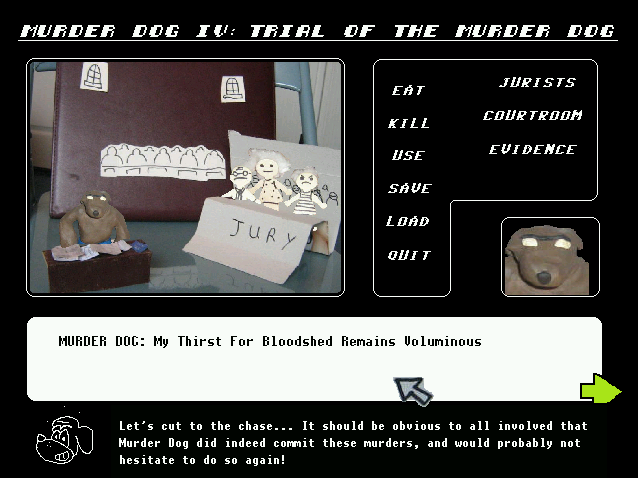

<!--
                                                   -- __
                                                 ~ (@)  ~~~---_
                                               {     `-_~,,,,,,)
                                               {    (_  ',
                                                ~    . = _',
                                                 ~    '.  =-'
                                                   ~     :
.                                                -~     ('');
'.                                         --~        \  \ ;
  '.-_                                   -~            \  \;      _-=,.
     -~- _                          -~                 {  '---- _'-=,.
       ~- _~-  _              _ -~                     ~---------=,.`
            ~-  ~~-----~~~~~~       .+++~~~~~~~~-__   /
                ~-   __            {   -     +   }   /
                         ~- ______{_    _ -=\ / /_ ~
                             :      ~--~    // /         ..-
                             :   / /      // /         ((
                             :  / /      {   `-------,. ))
                             :   /        ''=--------. }o
                .=._________,'  )                     ))
                )  _________ -''                     ~~
               / /  _ _
              (_.-.'O'-'.
-->

In *Murder Dog IV: Trial of the Murder Dog*, you play the role of Murder Dog, who is on trial at The Hague for crimes against humanity. 10/10 dark comedy. 

I didn't make this game, but I ported the game to macOS. [You can download it from the official website.](http://harmonyzone.org/MurderDogIV.html)
