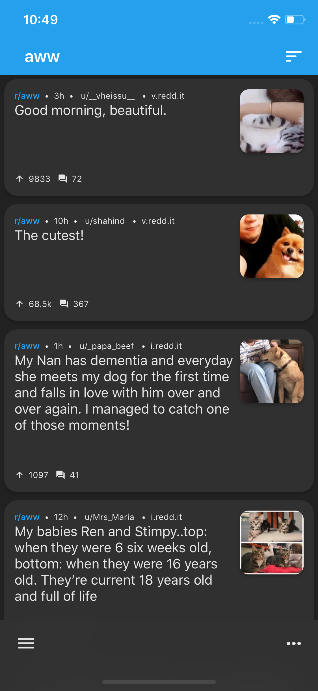
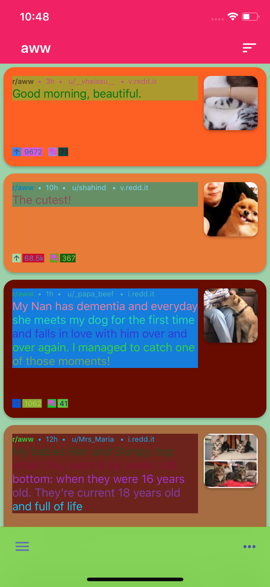
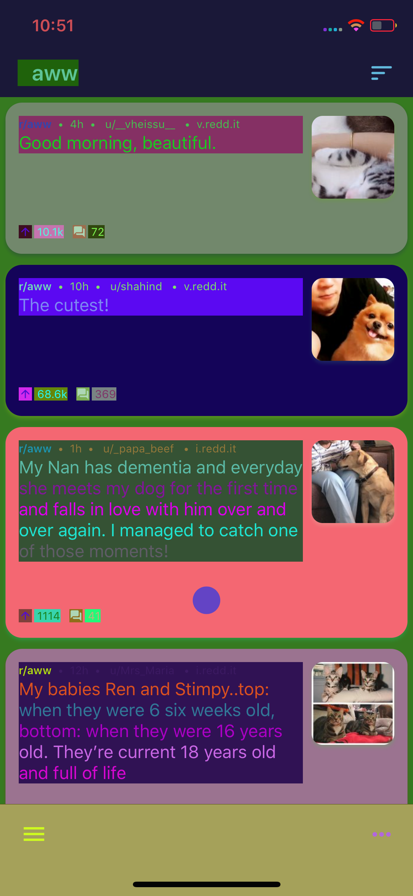
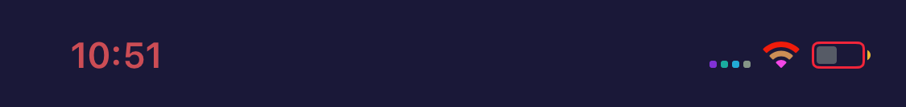

Lately, I've helped contribute to [Slide for Reddit](https://github.com/ccrama/Slide-iOS), an open-source Reddit client for iOS written in Swift. We're reconsidering some aspects of our UI customization options, and I'm of the opinion that the user just doesn't have the tools they need to make the app as ugly as humanly possible. As a joke, I wanted to randomize all the colors throughout the app just to see what it would look like. That led to an interesting question: is it possible to write an extension for `UIColor` that forces all instances to be randomized when they are used?

This was a surprisingly deep rabbit hole to jump into.

## First Steps

It is not possible to override a property or method inside of a Swift extension. This precludes doing something fishy like overriding `UIColor`'s initializer. In any case, we want the color to change every time it is accessed, so we would need to override a property of `UIColor`.

Interestingly, `UIColor`s are not used directly for drawing; instead, they serve a `CGColor` instance via their `cgColor` property when accessed. If we could override `cgColor` in our extension, we could return a random color from there, but this is not allowed. Or at least, it isn't allowed in pure Swift.

The Objective-C runtime allows us to perform _method swizzling_, which is a technique that replaces the implementation of a selector with another implementation at run time. After a brief read on this topic, I had the following code:

```swift{numberLines: false}
extension UIColor {

  class func jc_swizzle() {
    let originalSelector = #selector(getter: cgColor)
    let swizzledSelector = #selector(randomCGColor)
    let originalMethod = class_getInstanceMethod(self, originalSelector)!
    let swizzledMethod = class_getInstanceMethod(self, swizzledSelector)!
    method_exchangeImplementations(originalMethod, swizzledMethod)
  }

  @objc func randomCGColor() -> CGColor {
    return CGColor(
      colorSpace: CGColorSpaceCreateDeviceRGB(),
      components: [
        CGFloat(Float(arc4random()) / Float(UINT32_MAX)), // R
        CGFloat(Float(arc4random()) / Float(UINT32_MAX)), // G
        CGFloat(Float(arc4random()) / Float(UINT32_MAX)), // B
        1.0, // A
        ])!
  }

}
```

In `jc_swizzle()`, we swap the getter for `UIColor.cgColor` with the extension function `randomCGColor()`. This in theory does what we want! Let's see what it looks like:



What?! That looks good! That can't be right. What happened?

## Class Clusters

As it turns out, Apple makes use of an Objective-C pattern called a _[class cluster](https://developer.apple.com/library/archive/documentation/General/Conceptual/CocoaEncyclopedia/ClassClusters/ClassClusters.html)_ in `UIColor`. Under the hood, there are many private subclasses of `UIColor`, but they're all hidden from any public interface. That means we just overrode the method of a class that doesn't actually ever get used.

So then, let's find out what class some random `UIColor` instance resolves to. For `UIColor.red`, that ends up being `UICachedDeviceRGBColor`. Let's work on that:

```swift{numberLines: false}{5}
public extension UIColor {

  public static func jc_swizzle() {
    // This resolves to `UICachedDeviceRGBColor`
    let _class: AnyClass! = object_getClass(UIColor.red)

    let originalMethod = class_getInstanceMethod(_class, #selector(getter: cgColor))
    let swizzledMethod = class_getInstanceMethod(_class, #selector(randomCGColor))

    if let originalMethod = originalMethod, let swizzledMethod = swizzledMethod {
      method_exchangeImplementations(originalMethod, swizzledMethod)
    }
  }

  dynamic func randomCGColor() -> CGColor {
    return CGColor(colorSpace: CGColorSpaceCreateDeviceRGB(), components: [
      CGFloat(Float(arc4random()) / Float(UINT32_MAX)), // R
      CGFloat(Float(arc4random()) / Float(UINT32_MAX)), // G
      CGFloat(Float(arc4random()) / Float(UINT32_MAX)), // B
      1.0, // A
      ])!
  }

}
```



This works. On the highlighted line, we get the class object for `UIColor.red` (`UICachedDeviceRGBColor`), which we then pass as the first argument to `class_getInstanceMethod` instead of `UIColor.self`. By swizzling `UICachedDeviceRGBColor` we can affect many, many more colors.

But who knows how many other `UIColor` subclasses there are? I couldn't stop here. I wanted to ruin _all_ the colors. The code that results from this path of inquiry is horrible and evil and will absolutely get you rejected from the App Store. Apple doesn't like developers referencing private headers, after all. Let's do it anyway.

How can we reference the private internal objc classes that back `UIColor`? Well, we can use `NSClassFromString()` to get them if we know their names. We know about `UICachedDeviceWhiteColor` and `UICachedDeviceRGBColor` but who knows how many others there are under the hood?

Well, I knows. The answer is ten:
- `UIDeviceRGBColor`
- `UICachedDeviceRGBColor` (derives from `UIDeviceRGBColor`)
- `NSColor`
- `UIDisplayP3Color`
- `UIPlaceholderColor`
- `UICIColor`
- `UIDeviceWhiteColor`
- `UICachedDeviceWhiteColor` (derives from `UIDeviceWhiteColor`)
- `UICGColor`
- `UICachedDevicePatternColor` (derives from `UICGColor`)

I found these by grepping through [a dump of the private headers in iOS 11.4](https://github.com/nst/iOS-Runtime-Headers). If you'd like to do this yourself, run `grep -r -n ".\+:\s*UIColor".` in the terminal (you'll also want to run this again for each subclass you discover, replacing `UIColor` with the new class name just in case there are any subclasses of those). Let's use these:

```swift{numberLines: false}
public extension UIColor {

  private struct StaticVars {
    // Names of classes to swizzle. Derived from dumped private headers.
    static let classesToSwizzle: [String] = [
      "UIColor",
      "UIDeviceRGBColor",
      "NSColor",
      "UIDisplayP3Color",
      "UIPlaceholderColor",
      "UICIColor",
      "UIDeviceWhiteColor",
      "UICGColor",
      "UICachedDeviceRGBColor",
      "UICachedDeviceWhiteColor",
      "UICachedDevicePatternColor",
    ]

    static let randomColorBlock: @convention(block) (AnyObject?) -> CGColor = { _ -> (CGColor) in
      return CGColor(colorSpace: CGColorSpaceCreateDeviceRGB(), components: [
        CGFloat(Float(arc4random()) / Float(UINT32_MAX)), // R
        CGFloat(Float(arc4random()) / Float(UINT32_MAX)), // G
        CGFloat(Float(arc4random()) / Float(UINT32_MAX)), // B
        1.0, // A
        ])!
    }
  }

  public static func jc_swizzle() {
    for className in StaticVars.classesToSwizzle {
      if let classFromString = NSClassFromString(className),
        let originalMethod = class_getInstanceMethod(classFromString.self, #selector(getter: cgColor)) {
        method_setImplementation(originalMethod, imp_implementationWithBlock(
          unsafeBitCast(StaticVars.randomColorBlock, to: AnyObject.self)
          ))
      }
    }
  }

}
```

This is much, _much_ more effective:



Note how everything is affected, including the individual drawable elements in the status bar:



This is a fine solution, but it doesn't satisfy the engineer in me. What happens when iOS updates? What if there are classes that I missed?

## Things Get Worse

Shortly after writing this code, I was made aware of `objc_getClassList()`. This creates a list of class objects for _every single_ class loaded at runtime. In fact, on my phone running iOS 11.3.1, that list contains 25,265 elements. Let's parse these instead of keeping a list of strings:

```swift{numberLines: false}
public extension UIColor {

  private struct StaticVars {
    static let randomColorBlock: @convention(block) (AnyObject?) -> CGColor = { _ -> (CGColor) in
      return CGColor(colorSpace: CGColorSpaceCreateDeviceRGB(), components: [
        CGFloat(Float(arc4random()) / Float(UINT32_MAX)), // R
        CGFloat(Float(arc4random()) / Float(UINT32_MAX)), // G
        CGFloat(Float(arc4random()) / Float(UINT32_MAX)), // B
        1.0, // A
        ])!
    }
  }

  private static func jc_swizzle() {

    // Returns true if the given class has `superclass` anywhere in its class hierarchy
    func isClassSubclassOf(_ base: AnyClass?, superclass: AnyClass) -> Bool {
        var _class: AnyClass? = base
        while _class != nil && _class != superclass {
            _class = class_getSuperclass(_class)
        }
        return _class == superclass
    }

    var classCount = objc_getClassList(nil, 0)
    var allClasses = UnsafeMutablePointer<AnyClass?>.allocate(capacity: Int(classCount))
    var autoreleasingAllClasses = AutoreleasingUnsafeMutablePointer<AnyClass?>(allClasses)
    classCount = objc_getClassList(autoreleasingAllClasses, classCount)

    for i in 0 ..< classCount {
      if let currentClass: AnyClass = allClasses[Int(i)],
        isClassSubclassOf(currentClass, superclass: UIColor.self),
        let originalMethod = class_getInstanceMethod(currentClass.self, #selector(getter: cgColor)) {
        method_setImplementation(originalMethod, imp_implementationWithBlock(
          unsafeBitCast(StaticVars.randomColorBlock, to: AnyObject.self))
        )
      }
    }

  }

}
```

Here we use `objc_getClassList` to look through _every single class_ registered at runtime, swizzling the ones that derive from `UIColor`. This has two benefits. Firstly, because we're not directly referencing any private derivatives of `UIColor`, we're probably _(probably)_ not going to get rejected from the App Store for using this code. Secondly it is better from the standpoint that it will be resistant to changes in iOS in the future. This is guaranteed to replace all `UIColor` instance getters with the new random color logic, satisfying my original goal.

With that, we have an answer to _"Can I?"_ Perhaps the next article should go into _"Should I?"_
