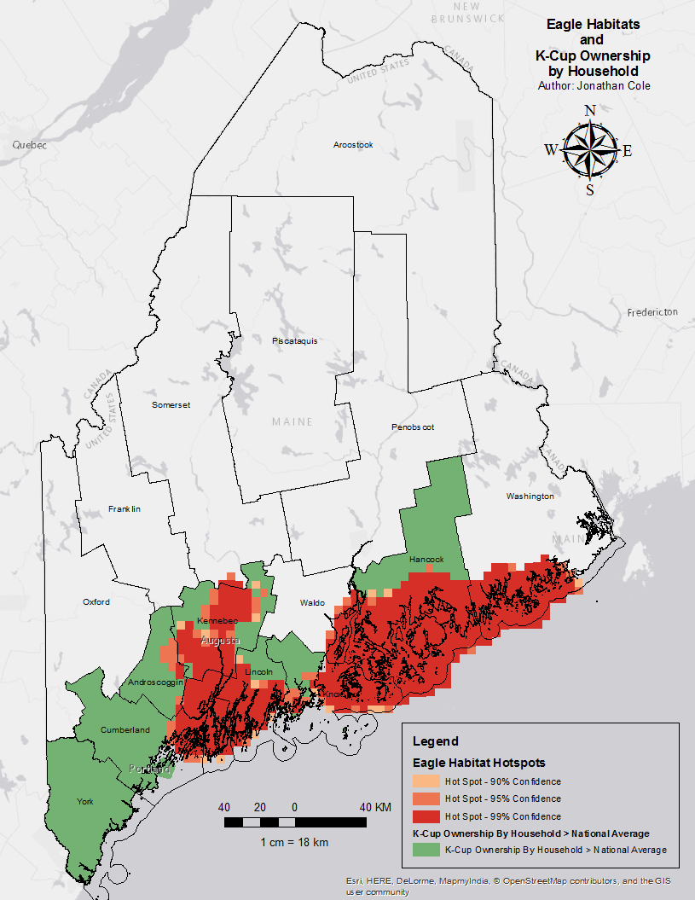
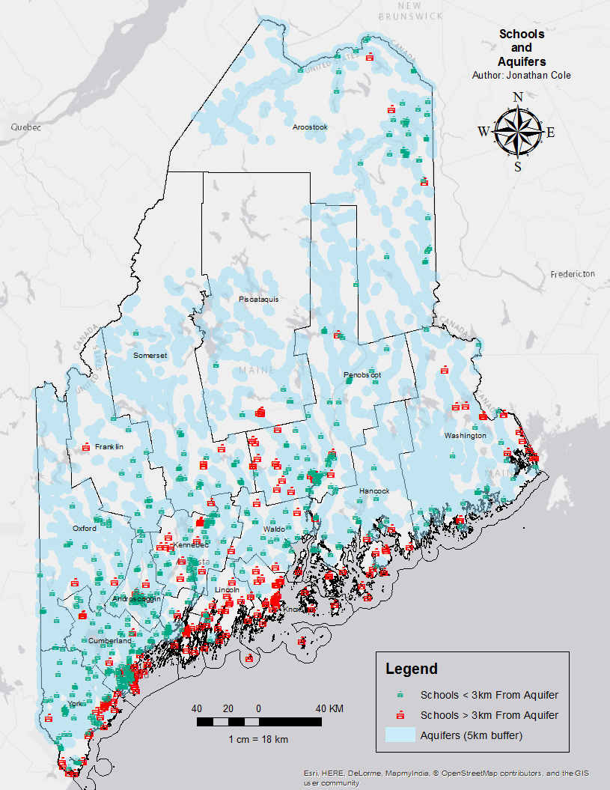
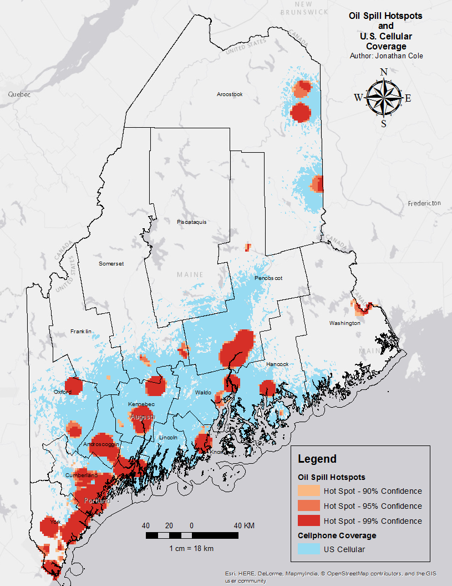
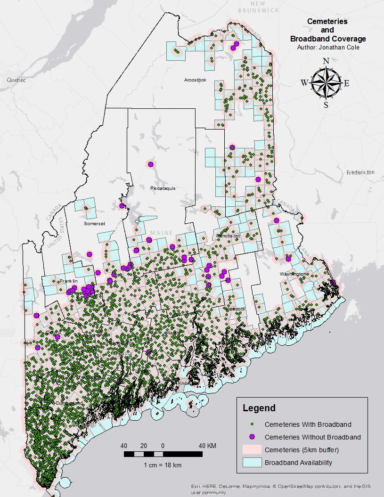
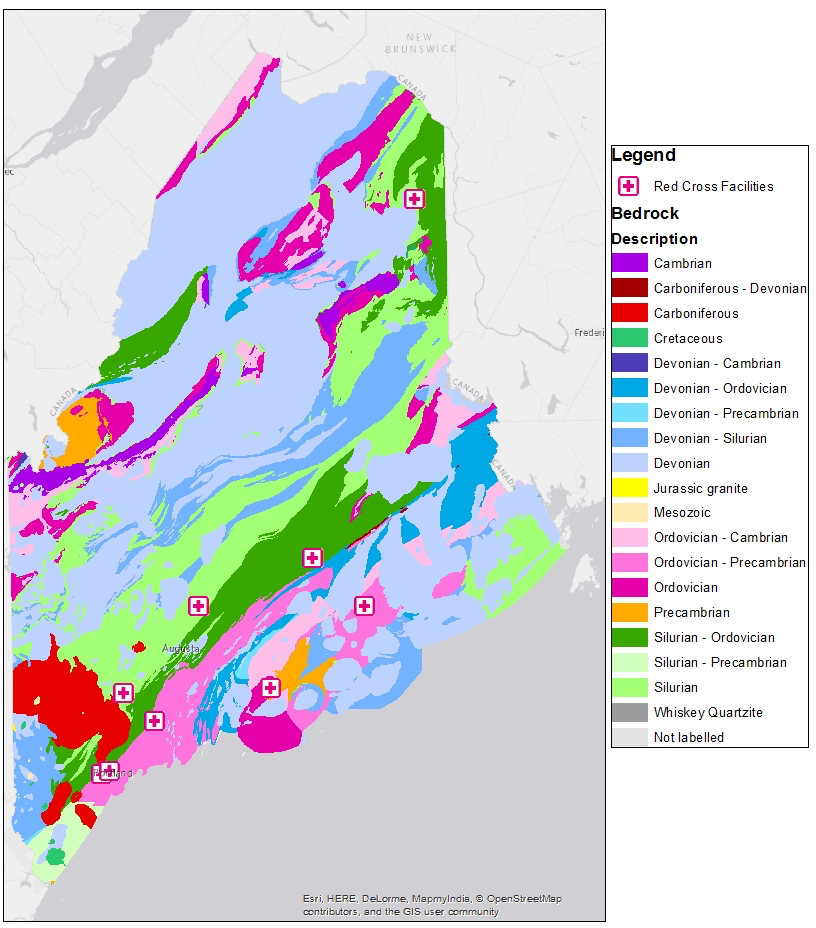

In grad school, I took a course called Spatial Analysis. In it, I learned how to analyze geospatial data and look for trends. For our term project, we were each to take a spatial dataset relevant to our fields and apply our skills. I recalled Tyler Vigen's [Spurious Correlations](http://www.tylervigen.com), a website that draws correlations between (hopefully) unrelated data sets such as the divorce rate in Maine and margarine sales per capita. There is a wealth of freely available spatial data made available by government agencies and ESRI, so I thought it would be funny to try out similar techniques with these data sets for the state of Maine.

These are my results.

## Eagles and K-Cups

With the exception of Washington County, eagles seem to make their homes in areas where household K-Cup ownership is at or higher than the national average.

## Schools and Aquifers

589 of Maine’s 795 schools are within 3 km of an aquifer. This means that if you are at a school, there is a 74% chance that you are within walking distance of a significant source of groundwater.

## U.S. Cellular Coverage and Oil Spill Hotspots

US Cellular offers great coverage in areas where hazardous oil spills occur the most.

## Cemeteries and Broadband Coverage

3875 of Maine's 3929 cemeteries are located exactly within broadband coverage areas (98.63%).

## Red Cross Facilities and Bedrock Formation Eras

In what I can only consider to be a deliberate move, Red Cross has built their facilities in Maine on top of bedrock formed before the Devonian era. This means that if you got into a time machine and went back to the period at which the bedrock was formed beneath any Red Cross facility, you would not find sharks, ferns, trees, insects, or land vertebrates.

**Disclaimer:**

These datasets are in no way scientifically rigorous.

## Sources
- <a href="http://www.maine.gov/dep/gis/datamaps/">Maine Department of Environmental Protection</a>
- <a href="http://www.maine.gov/megis/catalog/">Maine Office of GIS</a>
- <a href="https://usm.maine.edu/gis/digital-atlas">University of Southern Maine's Digital Atlas</a>
- ESRI Online Catalog

<!--
                                __.--'~~~~~`--.
             ..       __.    .-~               ~-.
             ((\     /   `}.~                     `.
              \\\  .{     }               /     \   \
          (\   \\~~       }              |       }   \
           \`.-~ -@~     }  ,-,.         |       )    \
           (___     ) _}  (    :        |    / /      `._
            `----._-~.     _\ \ |_       \   / /-.__     `._
                   ~~----~~  \ \| ~~--~~~(  + /     ~-._    ~-._
                             /  /         \  \          ~--.,___~_-_.
                          __/  /          _\  )
                        .<___.'         .<___/
-->