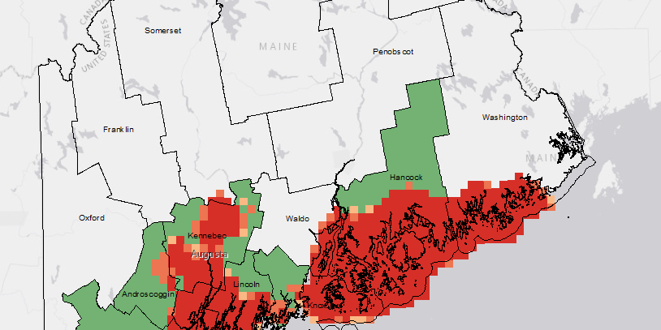

# H1
## H2
### H3
#### H4
##### H5

# Header 1

## Text styles

Here's some text.

_Here's some italic text._

**Here's some bold text.**

**Here's some bold _and_ italic text.**

`Here's some inline code.`

### In a paragraph

Here's some text.
_Here's some italic text._
**Here's some bold text.**
**Here's some bold _and_ italic text.**
`Here's some inline code.`

Here's some text.
_Here's some italic text._
**Here's some bold text.**
**Here's some bold _and_ italic text.**
`Here's some inline code.`

`Here's some inline code. This inline code is hopefully long enough to cause the line to wrap.`

## Block Quotes

> Here's some text.
>
> _Here's some italic text._
>
> **Here's some bold text.**
>
> **Here's some bold _and_ italic text.**
>
> `Here's some inline code.`


## Code blocks

```
This is a code block!
```

```swift{numberLines: true}
// This is a code block with Swift highlighting and numbered lines.
let x: Int = 0
let y: Bool = false
```

## Image Embed


<!-- https://gist.github.com/brandonkal/81aef71276a54536951c0f205797999c -->
# NOTE: This "post" is based on [Markdown Cheatsheet](https://github.com/adam-p/markdown-here/wiki/Markdown-Cheatsheet) and is meant to test styling of Gatsby Sites.

This is intended as a quick reference and showcase. For more complete info, see [John Gruber's original spec](http://daringfireball.net/projects/markdown/) and the [Github-flavored Markdown info page](http://github.github.com/github-flavored-markdown/).

This cheatsheet is specifically _Markdown Here's_ [^1] version of Github-flavored Markdown. This differs slightly in styling and syntax from what Github uses, so what you see below might vary a little from what you get in a _Markdown Here_ email, but it should be pretty close [^2]. This paragraph has two footnotes for testing.

You can play around with Markdown on our [live demo page](http://www.markdown-here.com/livedemo.html).

(If you're not a Markdown Here user, check out the [Markdown Cheatsheet](./Markdown-Cheatsheet) that is not specific to MDH. But, really, you should also use Markdown Here, because it's awesome. http://markdown-here.com)

##### Table of Contents

[Headers](#headers)
[Emphasis](#emphasis)
[Lists](#lists)
[Links](#links)
[Code and Syntax Highlighting](#code-and-syntax-highlighting)
[Tables](#tables)
[Blockquotes](#blockquotes)
[Inline HTML](#html)
[Horizontal Rule](#horizontal-rule)
[Line Breaks](#line-breaks)
[Videos](#videos)

## Headers

```no-highlight
# H1
## H2
### H3
#### H4
##### H5
###### H6

Alternatively, for H1 and H2, an underline-ish style:

Alt-H1
======

Alt-H2
------
```

# H1

## H2

### H3

#### H4

##### H5

###### H6

Alternatively, for H1 and H2, an underline-ish style:

# Alt-H1

## Alt-H2

## Emphasis

```no-highlight
Emphasis, aka italics, with *asterisks* or _underscores_.

Strong emphasis, aka bold, with **asterisks** or __underscores__.

Combined emphasis with **asterisks and _underscores_**.

Strikethrough uses two tildes. ~~Scratch this.~~
```

Emphasis, aka italics, with _asterisks_ or _underscores_.

Strong emphasis, aka bold, with **asterisks** or **underscores**.

Combined emphasis with **asterisks and _underscores_**.

Strikethrough uses two tildes. ~~Scratch this.~~

## Lists

```no-highlight
1. First ordered list item
2. Another item
  * Unordered sub-list.
1. Actual numbers don't matter, just that it's a number
  1. Ordered sub-list
4. And another item.

   Some text that should be aligned with the above item.

* Unordered list can use asterisks
- Or minuses
+ Or pluses
```

1. First ordered list item

2. Another item

   - Unordered sub-list.

3. Actual numbers don't matter, just that it's a number

   1. Ordered sub-list

4. And another item.

   Some text that should be aligned with the above item.

- Unordered list can use asterisks

- Or minuses

- Or pluses

## Links

There are two ways to create links.

```no-highlight
[I'm an inline-style link](https://www.google.com)

Or leave it empty and use the [link text itself]
```

[I'm an inline-style link](https://www.google.com)

Or leave it empty and use the [link text itself]

Fully qualified URLs will automatically be turned into links.
http://www.example.com

## Code and Syntax Highlighting

Code blocks are part of the Markdown spec, but syntax highlighting isn't. However, many renderers -- like Github's and _Markdown Here_ -- support syntax highlighting. _Markdown Here_ supports highlighting for dozens of languages (and not-really-languages, like diffs and HTTP headers); to see the complete list, and how to write the language names, see the [highlight.js demo page](http://softwaremaniacs.org/media/soft/highlight/test.html).

```no-highlight
Inline `code` has `back-ticks around` it.
```

Inline `code` has `back-ticks around` it.

Again, to see what languages are available for highlighting, and how to write those language names, see the [highlight.js demo page](http://softwaremaniacs.org/media/soft/highlight/test.html).

## Tables

Tables aren't part of the core Markdown spec, but they are part of GFM and _Markdown Here_ supports them. They are an easy way of adding tables to your email -- a task that would otherwise require copy-pasting from another application.

```no-highlight
Colons can be used to align columns.

| Tables        | Are           | Cool  |
| ------------- |:-------------:| -----:|
| col 3 is      | right-aligned | $1600 |
| col 2 is      | centered      |   $12 |
| zebra stripes | are neat      |    $1 |

The outer pipes (|) are optional, and you don't need to make the raw Markdown line up prettily. You can also use inline Markdown.

Markdown | Less | Pretty
--- | --- | ---
*Still* | `renders` | **nicely**
1 | 2 | 3
```

Colons can be used to align columns.

| Tables        |      Are      |  Cool |
| ------------- | :-----------: | ----: |
| col 3 is      | right-aligned | $1600 |
| col 2 is      |   centered    |   $12 |
| zebra stripes |   are neat    |    $1 |

The outer pipes (|) are optional, and you don't need to make the raw Markdown line up prettily. You can also use inline Markdown.

| Markdown | Less      | Pretty     |
| -------- | --------- | ---------- |
| _Still_  | `renders` | **nicely** |
| 1        | 2         | 3          |

## Blockquotes

```no-highlight
> Blockquotes are very handy in email to emulate reply text.
> This line is part of the same quote.

Quote break.

> This is a very long line that will still be quoted properly when it wraps. Oh boy let's keep writing to make sure this is long enough to actually wrap for everyone. Oh, you can *put* **Markdown** into a blockquote.
```

> Blockquotes are very handy in email to emulate reply text.
> This line is part of the same quote.

Quote break.

> This is a very long line that will still be quoted properly when it wraps. Oh boy let's keep writing to make sure this is long enough to actually wrap for everyone. Oh, you can _put_ **Markdown** into a blockquote.

## Inline HTML

You can also use raw HTML in your Markdown, and it'll mostly work pretty well.

```no-highlight
<dl>
  <dt>Definition list</dt>
  <dd>Is something people use sometimes.</dd>

  <dt>Markdown in HTML</dt>
  <dd>Does *not* work **very** well. Use HTML <em>tags</em>.</dd>
</dl>
```

<dl>
  <dt>Definition list</dt>
  <dd>Is something people use sometimes.</dd>

## Horizontal Rule

```
Three or more...

---

Hyphens

***

Asterisks

___

Underscores
```

Three or more...

------

Hyphens

------

Asterisks

------

Underscores

## Line Breaks

My basic recommendation for learning how line breaks work is to experiment and discover -- hit &lt;Enter&gt; once (i.e., insert one newline), then hit it twice (i.e., insert two newlines), see what happens. You'll soon learn to get what you want. "Markdown Toggle" is your friend.

Here are some things to try out:

```
Here's a line for us to start with.

This line is separated from the one above by two newlines, so it will be a *separate paragraph*.

This line is also a separate paragraph, but...
This line is only separated by a single newline, so it's a separate line in the *same paragraph*.
```

Here's a line for us to start with.

This line is separated from the one above by two newlines, so it will be a _separate paragraph_.

This line is also begins a separate paragraph, but...
This line is only separated by a single newline, so it's a separate line in the _same paragraph_.

(Technical note: _Markdown Here_ uses GFM line breaks, so there's no need to use MD's two-space line breaks.)

## Videos

It is easy to embed responsive external videos:

<iframe width="560" height="315" src="https://www.youtube.com/embed/b3_lVSrPB6w" frameborder="0" allow="accelerometer; autoplay; clipboard-write; encrypted-media; gyroscope; picture-in-picture" allowfullscreen></iframe>

```no-highlight
`<iframe width="560" height="315" src="https://www.youtube.com/embed/b3_lVSrPB6w" frameborder="0" allow="accelerometer; autoplay; clipboard-write; encrypted-media; gyroscope; picture-in-picture" allowfullscreen></iframe>`
```
------

## Code Highlighting

```javascript
    // In your gatsby-config.js
    // Let's make this line very long so that our container has to scroll its overflow…
    plugins: [
      {
        resolve: `gatsby-transformer-remark`,
        options: {
          plugins: [
            {
              resolve: `gatsby-remark-images`,
              options: {
                maxWidth: 756,
              },
            },
            {
              resolve: `gatsby-remark-responsive-iframe`,
              options: {
                wrapperStyle: `margin-bottom: 1.0725rem`,
              },
            },
            `gatsby-remark-copy-linked-files`,
            `gatsby-remark-smartypants`,
            `gatsby-remark-prismjs`,
          ]
        }
      }
    ]
```

Let's do something crazy and add a list with another code example:

- **A list item**

  …and a paragraph! In my younger and more vulnerable years my father gave me
  some advice that I’ve been turning over in my mind ever since.

  1. A nested numbered list
  2. “Whenever you feel like criticizing any one,” he told me, “just remember
     that all the people in this world haven’t had the advantages that you’ve
     had.”

- Roger that, now back to topic: _Highlighted code blocks work here, too:_

  ```css{10,13}
  .clearfix:after {
  	visibility: hidden;
  	display: block;
  	font-size: 0;
  	content: " ";
  	clear: both;
  	height: 0;
  	}
  .clearfix { display: inline-table; }
  /* Hides from IE-mac \*/
  * html .clearfix { height: 1%; }
  .clearfix { display: block; }
  /* End hide from IE-mac */
  ```

  Wow, "IE-mac"?
  [Yeah, that was a thing](https://en.wikipedia.org/wiki/Internet_Explorer_for_Mac)
  back in the day … a good one at the time, too:

  > Initial versions were developed from the same code base as Internet Explorer
  > for Windows. Later versions diverged, particularly with the release of
  > version 5 which included the cutting edge,
  > [fault-tolerant](https://en.wikipedia.org/wiki/Fault-tolerant) and highly
  > standards-compliant
  > [Tasman](<https://en.wikipedia.org/wiki/Tasman_(layout_engine)>) >
  > [layout engine](https://en.wikipedia.org/wiki/Layout_engine).

  Source: https://en.wikipedia.org/wiki/Internet_Explorer_for_Mac

- **The last list item** –- no more list items after this one, pinky swear!

# Some more prismjs Shell Highlights

I found the solution to [this issue here](https://github.com/matthewjweaver/mjw-toolbox/issues/75):

```shell
rm /usr/local/lib/opensc-pkcs11.so
cp -a $OPENSC_PK /usr/local/lib/opensc-pkcs11.so
ssh-add -s /usr/local/lib/opensc-pkcs11.so
```

Line break.

```shell
gpg --edit-key your@email.com
```

That is it!

---

[^1]: Lorem ipsum dolor sit amet, consectetur adipiscing elit, sed do eiusmod tempor incididunt ut labore et dolore magna aliqua. Ut enim ad minim veniam, quis nostrud exercitation ullamco laboris nisi ut aliquip ex ea commodo consequat. Duis aute irure dolor in reprehenderit in voluptate velit esse cillum dolore eu fugiat nulla pariatur.
[^2]: Excepteur sint occaecat cupidatat non proident, sunt in culpa qui officia deserunt mollit anim id est laborum.